```{r setup, include=FALSE}
knitr::opts_chunk$set(echo = FALSE)
```

# Contents  
1.0 Critique of Visualization  
1.1 Clarity  
1.2 Aesthetic  
2.0 Alternative Design  
3.0 Proposed Visualization  
4.0 Step-by-step Guide  
5.0 Derived Insights  

# 1.0	 Critique of Visualization#
The original visualization can be seen below.  
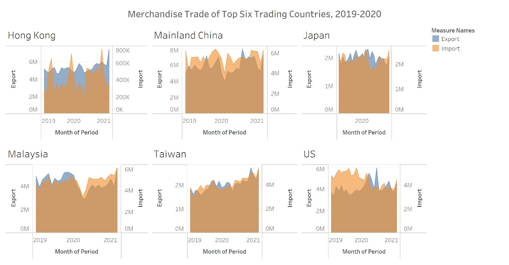

## 1.1 Clarity
* Chart title is vague – The title “Merchandise Trade of Top Six Trading Countries” does not reflect that the chart compares the top six countries in terms of import and export. 
* The length of the x-axis is different. The x-axis of the Japanese chart is obviously the shortest. Also, "month period" is marked below, but there are no tick marks to reflect month. The intervals of the y-axis are inconsistent, which makes it difficult to intuitively compare the import and export trade volumes of different countries.
* The unit is different. Hong Kong’s import indicator uses thousand US dollars as the unit, which is different from the million US dollars used by other indicators.
* The coordinate axes on the left and right sides of the chart represent the import and export respectively, which is not concise and unnecessary. and it is easy to cause confusion for readers.

## 1.2 Aesthetic
* The title is not eye-catching enough. The font size is not different from other characters, and it is not bold.
* The note "Month of period" below is redundant, because the month can be directly reflected by the interval of the abscissa.
* The six charts are typeset in two rows, which makes it difficult for users to compare their values on the vertical axis.

# 2.0 Alternative Design
The horizonal axis of the chart is the year (2019-2020), and the vertical axis is the merchandise trade volume (in thousands of U.S. dollars). The chart provides users with three options on the right-hand side panel:

* Country/Region: Mainland China, Hong Kong, Taiwan, the United States, Japan, Malaysia, ALL  
* Indicators: Import, Export, Trade deficit, ALL  
* Month: 1-12, ALL  
* Category: Import, Export, ALL  

The chart uses six different colors to represent six countries/regions and uses different color saturations to distinguish three indicator variables, which enable the users to perform diversified combinations under the circumstance of the given months or a month period, such as comparing the import indicators of multiple selected countries, comparing multiple indicators of specified country.
In addition, the user can also select a specific month or month range. The user can select January and December as a month range to obtain a polyline of annual changes. Users can also choose March, June, September, and December as the indicators at the end of each quarter, so that the corresponding four points will be marked on the polyline. The upper right corner of all polylines will show the growth rate or decline rate of the selected month range.  
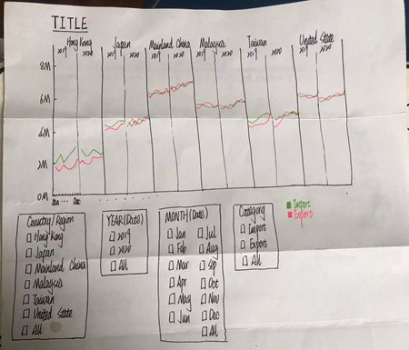

# 3.0 Proposed Visualization
Please view the interactive visualization on Tableau Public [here](https://public.tableau.com/app/profile/wang.xiyu/viz/Book2_16223555629660/Sheet1).

# 4.0 Step-by-step Guide
Import Data and combine two tables.  
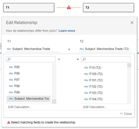  
Remove the redundant rows and columns. Rename table and headers.  
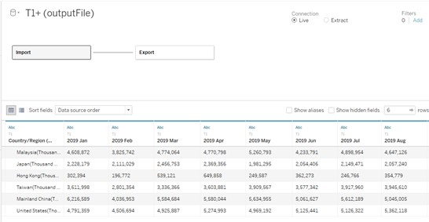  
Change the data type of the trade volume into number.  
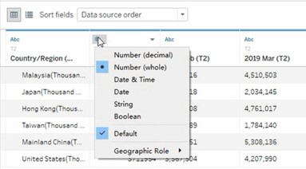  
Drug **Measure Values** to the Column tab, and drug **Measure Name** and **Country/Region** to the Rows tab. Add all months with **SUM** function into measure values.  
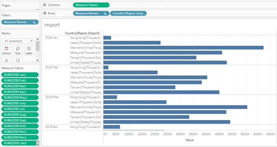  
Click view data in Tableau and export two tables of **Import** and **Export**.  
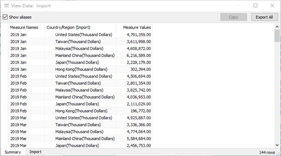  
Combine these two tables and insert a column named Category on the right side of the combined table. Import the cleaned data into Tableau and change the data type as shown.  
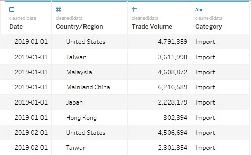  
Add **Category**, **YEAR(Date)**, **MONTH(Date)** to the Column tab and **SUM(Trade Volume)** to the Rows tab.  
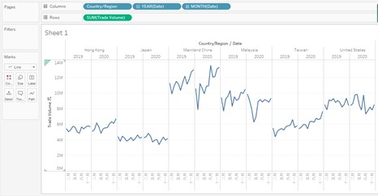  
Add **Category**, **YEAR(Date)**, **MONTH(Date)**, **Country/Region** to Filter and show them in the right panel.  
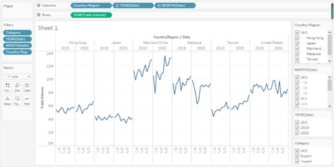  
Add **Category** to the Colour option to differentiate the performance of the Export Volume and Import Volume.  
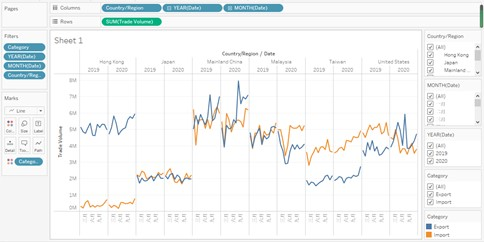  
Add another copy of **SUM(Trade Volume)** and change it to dual axis.  
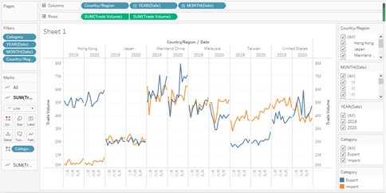  
Right click on the right Y-axis, select Synchronize Axis and deselect Show Header.  
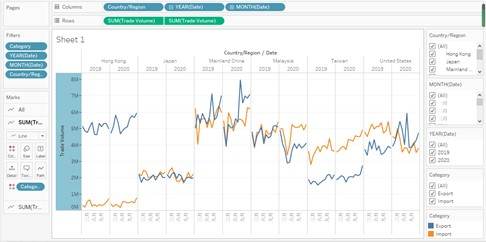  
Change panel from Automatic to Circle and choose an appropriate size for the mark.  
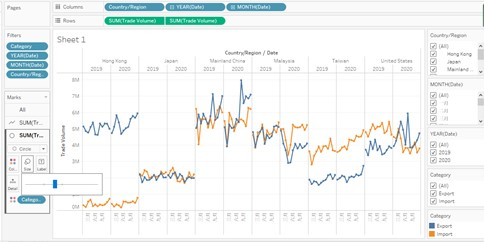  
 
# 5.0 Derived Insights
* During these two years, Hong Kong’s exports were significantly more than imports, while Taiwan’s was the opposite.
* The U.S. economy showed a trade deficit in 2019, and this situation was reversed in 2020.
* Mainland China is the largest import and export economy in the world, and the overall trend is steadily increasing.