```{r setup, include=FALSE}
knitr::opts_chunk$set(echo = FALSE)
```

# Contents  
1.0 Critique of Visualization  
    1.1 Clarity  
    1.2 Aesthetic  
2.0 Alternative Design  
3.0 Proposed Visualization  
4.0 Step-by-step Guide  
5.0 Derived Insights  

# 1.0	 Critique of Visualization#
The original visualization can be seen below.  
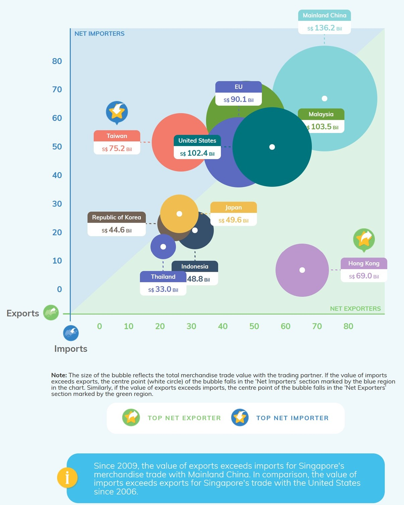{width=50%} 

## 1.1 Clarity
* There is no title. Readers cannot know the time range of the data, nor can they know why these ten markets are selected as representatives.  
* In the picture, a label is provided for each country's point, only showing a value, but does not indicate that the value represents the total import and export value of the market.  
* There is no labeling unit on the horizontal and vertical axes, and the placement of the variable names of the axes is easy to confuse the reader.  

## 1.2 Aesthetic
* The image background color setting is not necessary, which can easily distract readers. Also, the background colors of net importer and net exporter are too similar, which makes it difficult for readers to notice and distinguish the characteristics of which country at the first glance.  
* The position of the label corresponding to each circle is chaotic. The label of some circles will block the center white point of other circles. For the circles near the boundary point, it is difficult to determine which area their center point lies in.  
* The transparency of the dots is too low, which is a big problem for areas with dense dots. For example, the dots in Japan have almost completely covered the dots in Korea.  
* The content of Note is not conspicuous and redundant.  

# 2.0 Alternative Design#
This figure corrects the problems in the original figure, such as the problem of ambiguous titles, labels, and variable units. This figure removes the overall background color and the background colors of net importer and net exporter, and retains the diversified colors assigned to different countries for distinction. In addition, it omits the note below the original image and simplifies the marked icon, using the tooltip instead to provide more detailed content.  
* Chart 1 is the Motion Chart of Top 10 Trade Volume Market, which provides detailed data of each market at various time points, including import volume, export volume, total trade volume and ranking. Besides, it can also show users the dynamic growth orbit of each country from 2011 to 2020.  
* Chart 2 is the Interactive Bubble Plot of Top 10 Trade Volume Market, which shows the overall trade volume of each market within the time range of 2011 to 2020 by connecting the line chart of sheet 3. Users can obtain the line chart of the import and export volume of the market during the decade by placing the mouse on the dot.  
{width=50%}  

# 3.0 Proposed Visualization#
Please view the interactive visualization on Tableau Public [here](https://public.tableau.com/app/profile/wang.xiyu/viz/DataVizMakeover2_16241216210990/Dashboard1).  

# 4.0 Step-by-step Guide#
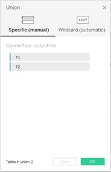{width=30%}  
Import the metadata table, drag the new union of the left panel to the top of the main panel, and then drag the T1 and T2 on the left panel to the dialog window as shown in the picture.  
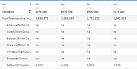{width=48%}
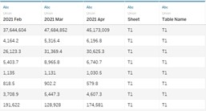{width=45%}   
The imported results (corresponding to the left and right sides of the table respectively) are shown in the figure. Next, we will deal with the leftmost column and the two rightmost columns of the table.  
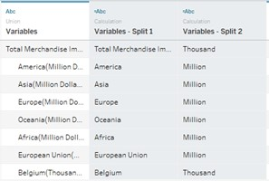{width=50%}   
First, right-click the header of the first column, and select split, then two new columns will appear as shown.  
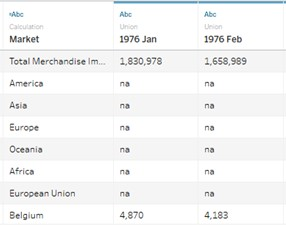{width=50%}  
By observing column “Variables-Split 2”, we find that the majority of the markets use thousand, and only a few use million as a unit. At the same time, it is shown that the corresponding data of the market using million are all null values, so we can ignore this problem, which does not affect our subsequent operations. Then, rename the column “Variables-Split 1” as “Market”, and hide the other two columns.  
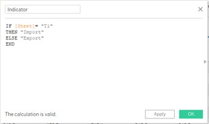{width=45%}
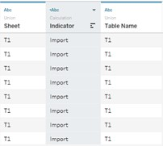{width=45%}  
As for the two rightmost columns of the table, create calculated field named “Indicator”, so that we can get a new column to help us distinguish the indicators of import and export.  
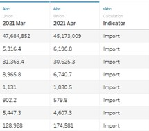{width=50%}  
Then hide column “Sheet” and “Table Name”.  
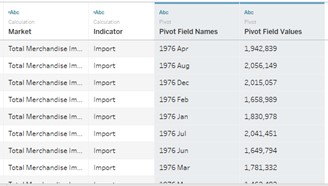{width=50%}  
Select all months’ data, right-click the header of any one of the columns, select pivot.  
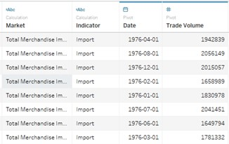{width=50%}  
Rename these two new columns as “Date” and “Trade Volume” and change their datatype into Date and Number.  
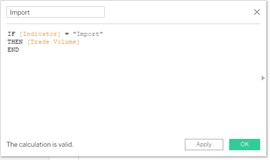{width=45%}
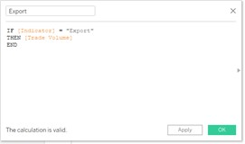{width=45%}  
Now we can move to Sheet 1. First, we use create calculated filed function to derive two new variables “Import” and “Export” using the formula shown above. Now, two more variables appear in the left panel. Going back to the Data Source interface, we also find that there are two new columns at the end of the table.  
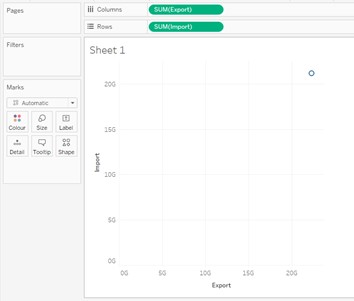{width=50%}  
Drag “Export” to Columns and drag “Import” to Rows. Now only one point is shown on the screen.  
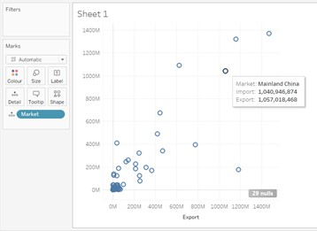{width=50%}  
Drag “Market” to Detail, now each point represents a market.  
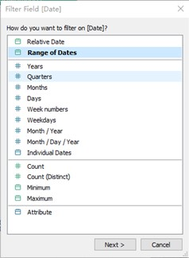{width=45%}
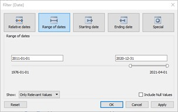{width=45%}  
Drag “Date” to Filter panel, and Filter Filed dialog window appear, then select “Range of Date”. Set the range from 2011-01-01 to 2020-12-31.  
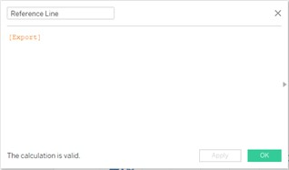{width=50%}  
Now we want to add a reference line to distinguish the net importer and net exporter, using create calculated filed function, makes the “Reference Line” equals to “Export”.  
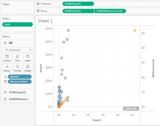{width=45%}
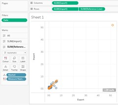{width=45%}  
Drag “Reference Line” to the righthand side axis, right-click the axis and select Synchronise Axis and Show Header.  
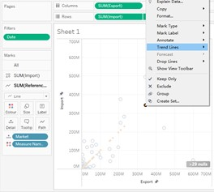{width=45%}
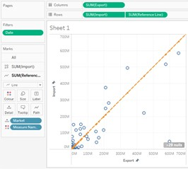{width=45%}  
Change Automatic to Line at the dropdown list of SUM(Reference Line) sub-panel, then right-click one of the point on the line and choose Trend Lines --- Show Trend Lines.  
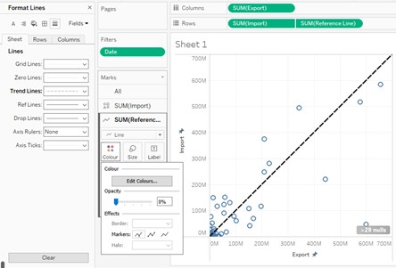{width=50%}  
We have made the reference line, but there are many points on it, which greatly affect the cleanliness of the picture. To solve this problem, we can change the transparency to 0, and we can also change the line to a more suitable color.  
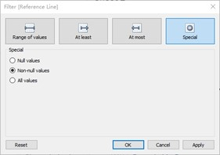{width=45%}
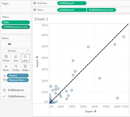{width=45%}  
Adding “Reference Line” to Filter enables us to eliminate the null values.  
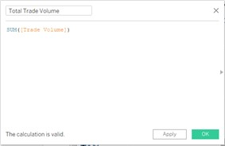{width=50%}  
Create calculated field “Total Trade Volume”, which means the total trade volume of a specific market within a certain period.  
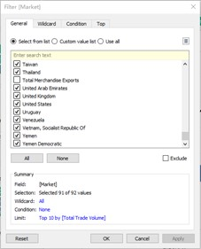{width=45%}
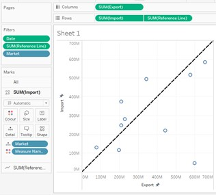{width=45%}  
Add “Market” to filter, exclude the Total Merchandise data and choose the Top 10 Market by “Total Trade Volume”.  
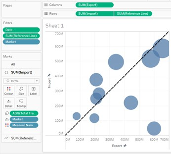{width=50%}  
Change Automatic to Circle, drag Market to Size and set an appropriate size. lower the transparency.  
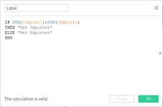{width=50%}  
Create calculated field “Label” to identify whether the specific market is a net importer or a net exporter.  
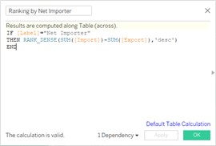{width=45%}
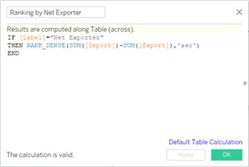{width=45%}  
Create calculate field “Ranking by Net Importer” and “Ranking by Net Exporter”.  
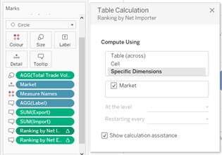{width=50%}  
Drag these three new derived variables to Tooltip. Press the triangle symbol behind “Ranking by Net Importer” and select Edit Table Calculation. Change compute using to Specific Dimensions and tick the box of Market.  
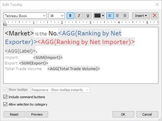{width=45%}
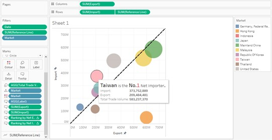{width=45%}  
Drag “Market” to Colour and Edit Tooltip as shown above. Now it enables the users get detailed information about the market while placing the mouse on any point.  
 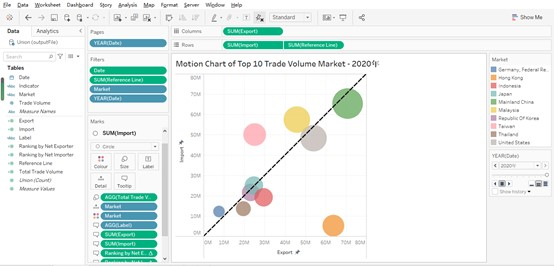{width=80%}  
Drag “YEAR(Date)” to Page panel, click Format---Animations, turn Workbook Default on and set the Duration to 0.5 seconds. Show the filter and rename the title of the chart.  
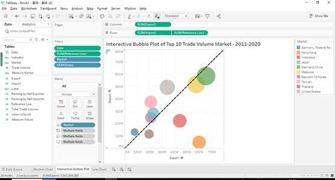{width=80%}  
Duplicate sheet 1 and remove “YEAR(Date)” from Page pane, now we can move to sheet 3 to create a line chart.  
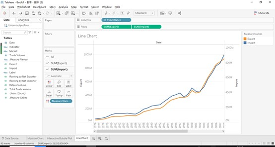{width=80%}  
Drag “Date” to Columns and drag ”Export” and “Import” to Rows.  
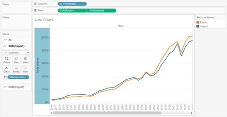{width=80%}  
Right-click the right-hand side axis and click Synchronise Axis and Show Header. Rename the left-hand side axis to “Trade Volume”.  
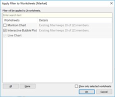{width=45%}
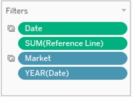{width=45%}  
Drag “Market” and “Date” to Filter pane, Apply to Worksheets---Selected Worksheets---Interactive Bubble Plot.  
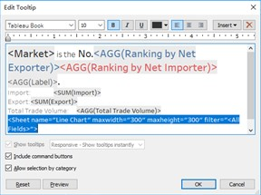{width=50%}  
Enter Edit Tooltip window, click Insert dropdown list and chose Line Chart under Sheets.  
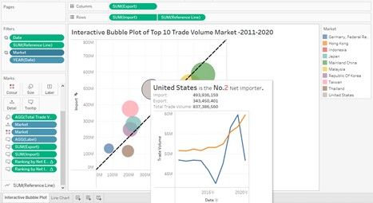{width=80%}  
Now when we hover the mouse on the dot, the trade volume line chart of the market in 2011-2020 will be displayed.  

# 5.0 Derived Insights#
* From 2011 to 2020, China's import and export volume has maintained a steady growth trend, and in 2013 it surpassed Malaysia to become the largest trade market. Taiwan has also maintained its upward momentum, and according to the line chart, Taiwan is very likely to have a milestone with a trade deficit in 2021. On the contrary, Indonesia keep decreasing both in import volume and export volume during the decade.   
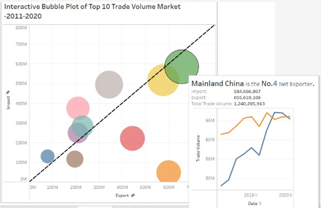{width=45%}
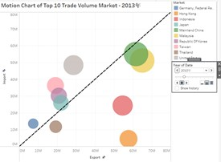{width=45%}  
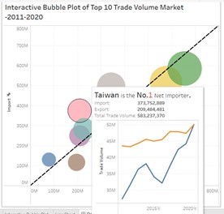{width=45%}
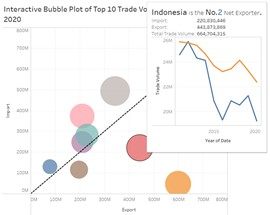{width=45%}  
* In the past ten years, Hong Kong has maintained a floating state close to the axis of abscissas, with export volume multiples greater than the import volume. Germany, Thailand, Japan, and South Korea showed similar patterns that their import volume trends are relatively stable, while the export volume fluctuates significantly.  
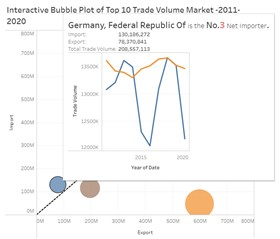{width=45%}
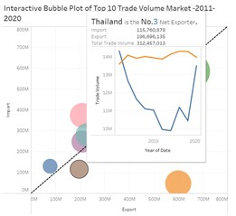{width=45%}  
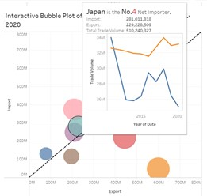{width=45%}
{width=45%}  
* Net exporters are mostly market of developing countries, such as China, Malaysia, Thailand, and Indonesia. While net importers are mostly market of developed countries, such as the United States, Japan, and Germany.