```{r setup, include=FALSE}
knitr::opts_chunk$set(echo = TRUE)
```

## 1.Introduction
Sociodemographic, spatial, and temporal are the three key types of information used to analyze crime data. Crime is a complex event which requires a law, an offender, and a target to intersect in a place at one time, which means that crimes may spatially cluster because the offenders might have invested their time and energy to master the “battleground,” or there might be more susceptible targets. Finding these spatial crime clusters would help the purpose to aid criminal apprehension, crime reduction, prevention, and evaluation. 
The driving record of the suspect has always been an important clue to most criminal cases. Through the analysis of the movement of individual people, we can find the suspect's regular route and regular schedule which is the key in understanding patterns of their movements. 

## 2.Problem Statement
During the celebration of GAStech's IPO, several employees of the company were strangely missing. Fortunately, Many of the Abila, Kronos-based employees of GAStech have company cars which are approved for both personal and business use. These cars are equipped with GPS tracking devices, which can provide tracking data for two weeks before the disappearance (no data on the day of disappearance). Credit card and loyalty card transactions data are also provided for case investigation.
Taking the GPS monitoring results of the company's employees as a whole can help us understand whether the company has organized group activities at a specific time, such as company team building or overtime, which leads to unexpected group behavior. This helps the police find out the suspect’s unusual travel time and destination. As for the credit card and loyalty card consumption records can help us find out whether the suspect has suspiciously large expenditures, and investigate whether it is possible to purchase suspicious items as criminal tools of crime through the location and name of business of the purchased items.

## 3.Lecture Review
There is an increasing trend of usage of line plots, geographic maps, heat maps, histograms, and graphs for time series data. Below is the lecture review of several examples of interactive visual analysis available.  

### 3.1 Regional Map  
Regional map can be used to analyze data by region, reflecting the basic natural and economic conditions and regional characteristics of a certain region. The most common example is the administrative area map, which can realize the level-by-level drilling from the province to the city and realize the different degrees of color and label for a certain characteristic. For example, the sales in the figure below can be drilled from province to city. The larger the sales, the darker the color.  
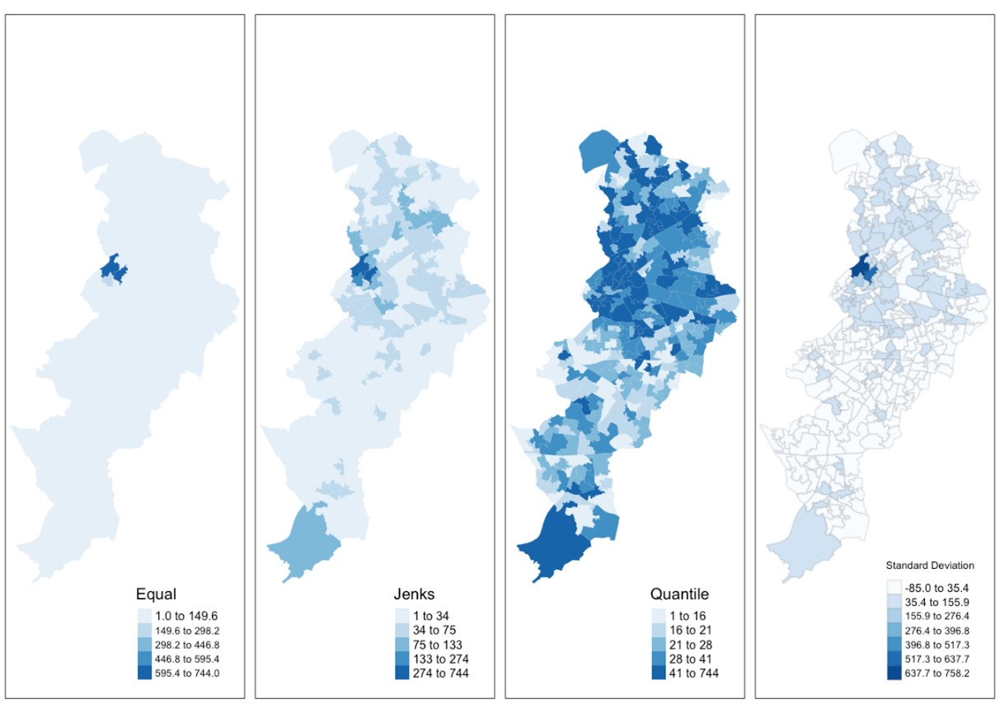{width=70%}   

### 3.2 Heatmap  
The heatmap is used to convert data into color tones within the geographic coordinate system, and intuitively reflect the distribution, frequency or density of the data in the geographic space through the degree of color change. The following figure shows the level of PM2.5 in environmental monitoring in various regions of the country.  
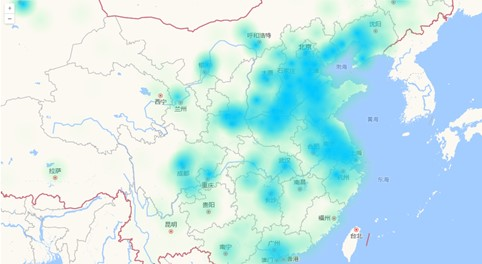{width=70%}  

### 3.3 Bubble Map  
Bubble map is a very common visualization map related to geographic location information. It can transmit multi-dimensional information at the same time. The location of the bubble is used to transmit physical location information. The size of the bubble indicates the value of variable 1, and the color of the bubble can be identified. The size/category of variable 2 can be produced as a .gif with a time frame to represent the change of each variable over time.  
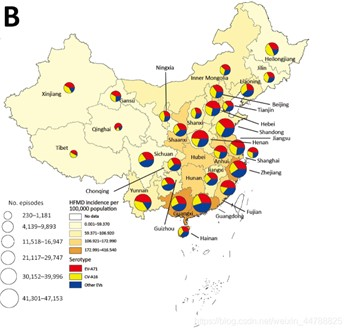{width=70%}   

### 3.4 Flow Map  
The flow map displays information or the movement of objects from one location to another and the number of objects on the map. Usually used to display migration data of people, animals, and products. The scale or number of movements represented by a single flow line is represented by its thickness, which helps to show the geographical distribution of migration activities. The flow map is mostly used in scenarios such as interregional trade, traffic flow, population migration, shopping and consumption behavior, communication information flow, and aviation routes. It can also be applied to enterprise cargo transportation and supply chain management. The movement path of the migrants during the Spring Festival is shown in the following figure.  
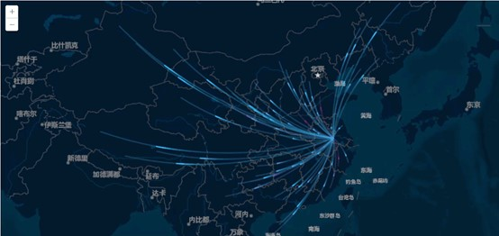{width=70%}   

### 3.5 Trajectory graph  
Different lines can be identified by different colors, and the size of the line thickness is used to indicate the size of the passenger flow. The thicker the line, the greater the passenger flow, and it can also indicate the direction of the track line. Operators can use this visualization effect to intuitively judge the distribution of passenger flow in a certain period of time and the ride behavior of different routes in order to arrange operations reasonably.  
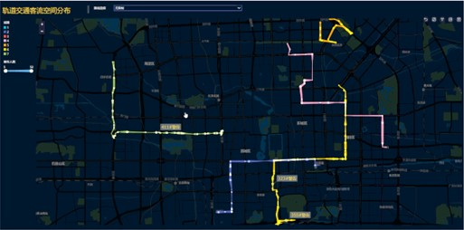{width=70%}   

## 4. Step by Step Guide  

### 4.1 Set Up Environment  
### 4.1.1 Installing and Launcingh R Packages  
The code chunk below will check if the R packages have been installed, if not, R will install the missing packages before launching them.  
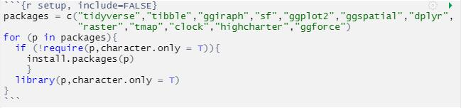

### 4.1.2 Plotting Raster Layer 
First, import MC2-tourist.jpg into R by using raster() of Raster package and name it as "bgmap". Then use tm_rgb() to plot the raster layer and name the picture as "bgmap1".  
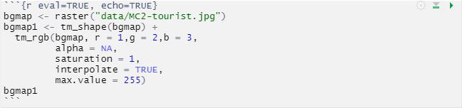  
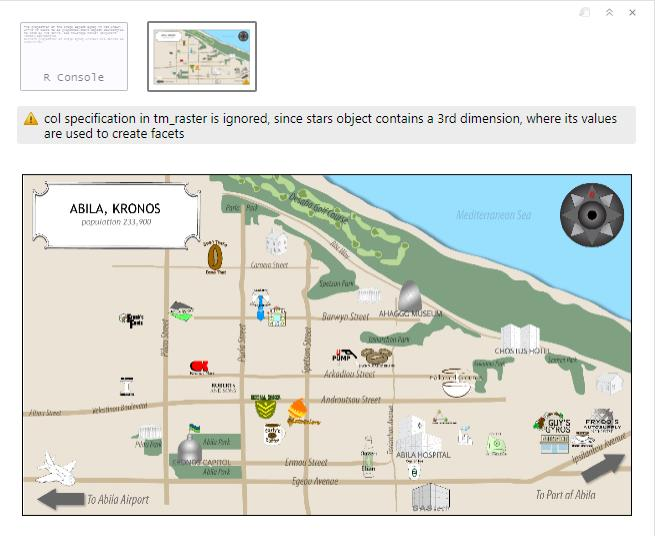  

### 4.1.3 Importing Vector GIS Data File  
Because Abila GIS data layer is in ESRI shapefile format, which is in vector data model with line feature class, we need to use st_read() of sf package to import it into R. Name it as "Abila_st".   
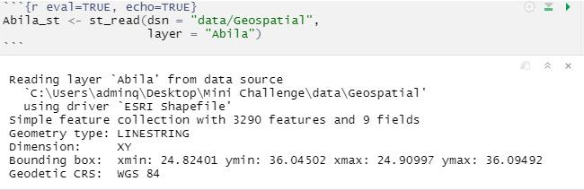  

### 4.1.4 Importing GPS Tracking Data  
This code chunk import "gps.csv" into R by using "read_csv()" of readr package. 
We need to change the original "Timestamp" field into date-time format using data-time_parse() of clock package, and change id field as factor data type using as_factor() of factors package.  
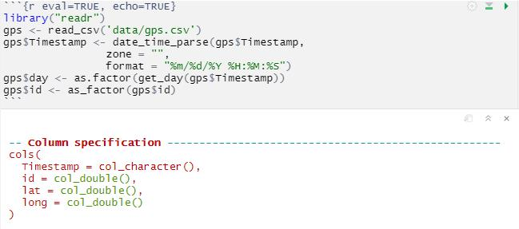  
Then, use st_as_sf() of sf packages to convert gps data set into a simple feature data set.Now, each row in the gps_sf table represents the coordinates of the vehicle at a specific time, which can be regarded as a point on the map.  
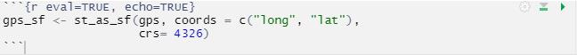  

### 4.1.5 Importing the Transaction Data  
Import"loyalty_data.csv" and "cc_data" using "read_csv()" and change the format of the timestamp.  
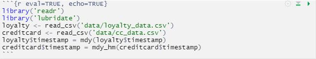  

### 4.2 Exploratory Data Analysis  
### 4.2.1 Transaction Data Exploration  
Extract the two columns of timestamp and location from the original data table of credit card and loyalty card, and add a column as label.  
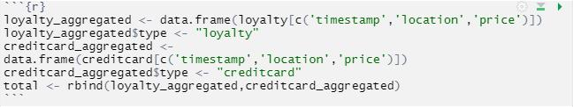  
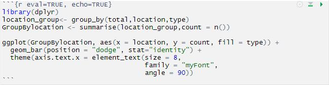  
As can be seen from the bar chart below, there are four shops that are obviously more popular compared with merchants: Katerina's Cafe, Hippokampos, Guy's Gyros and Brew've Been Served.  
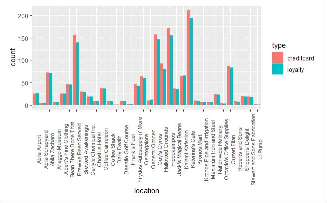  
Derive date and hour from timestamp, adding to the table.
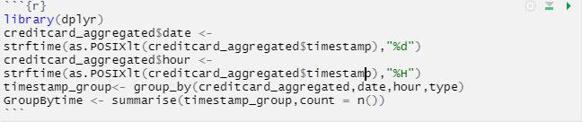   
Through the observation of the heatmap, it can be inferred that the merchant’s business hours are 7-21 o'clock on weekdays and 12-20 o’clock on weekends, of which 7 o’clock, 12-13 o’clock and 20 o’clock are the morning, middle and evening peak hours of the day. Therefore, visits during non-business hours can be regarded as abnormal situations worthy of the police’s attention.
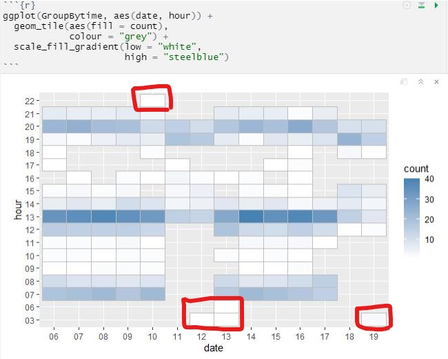  
Judging from the scatter plot of the transaction volume of each store, the overall consumption is relatively even. Among these stores, the transaction data of a few stores is more prominent, but none of them has a single transaction exceeding 5000 dollars. However, there is indeed an extreme outlier appeared in Frydos Autosupply n’ More, with a single transaction amount of 10,000, which is likely to be the behavior of the suspect.
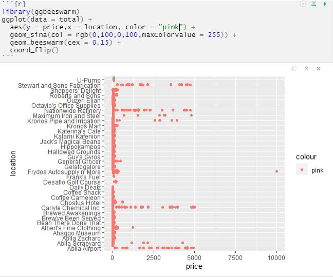 

### 4.2.2 Geospatial Data Exploration  
Through the following code, we can get all the image of driving route records of all suspects during the specified time period, which is very overlapping and messy and cannot help the police to distinguish.   
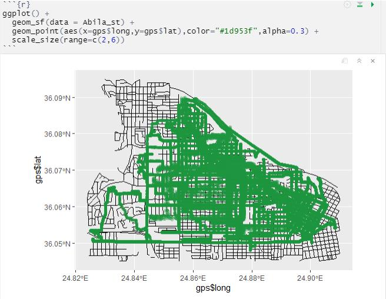  
So, we should use the code chunk below joins the gps points into movement paths by using the drivers' IDs as unique identifiers.   
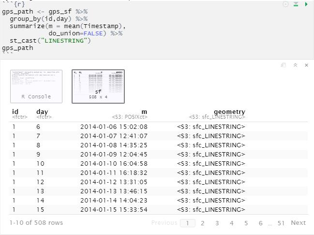  
The code chunk below is used to overplot the gps path of driver ID 1 onto the background tourist map.
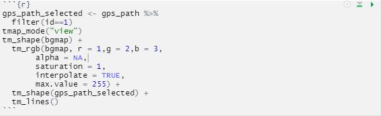  
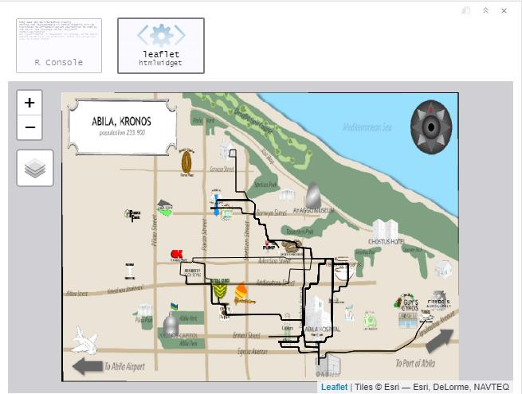  

### 4.2.3 Card Ownership  
Because both the consumption data of the cards and the driving record data have timestamp variable, we can use the same time variables in these two tables to identify which vehicles stayed at a specific merchant at a specific time. And then find the corresponding consumers through the vehicle assignment data table, so that we can generate a list including all associations of card numbers and consumers. The combinations that appear frequently in multiple lists, that is, the association with the highest frequency, can be preliminarily determined as the ownership between the card and the consumer.  
However, this method will have some limitations, because we use the dispatching relationship of the car as a medium to determine the relationship between the cards and the consumers. In fact, unexpected situations are likely to occur, for example, people use cards other than their own to make a transaction, or someone drives someone else's car to spend at the merchant.   

### 4.2.4 Potential Relationship  
We can use timestamp and location indicator of transaction data to group card numbers to find out which cards are used for consumption at the same merchant at the same time.Through this result, we can utilize the result of the previous question to find the owners of the cards in a one-to-one correspondence. People in the same timestamp-location group may have had contact, which enables the police to infer potential relationships.  